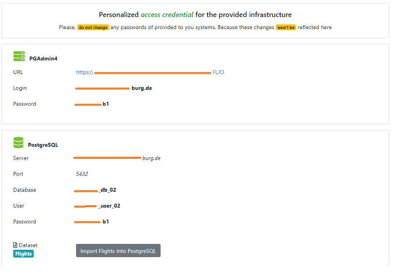
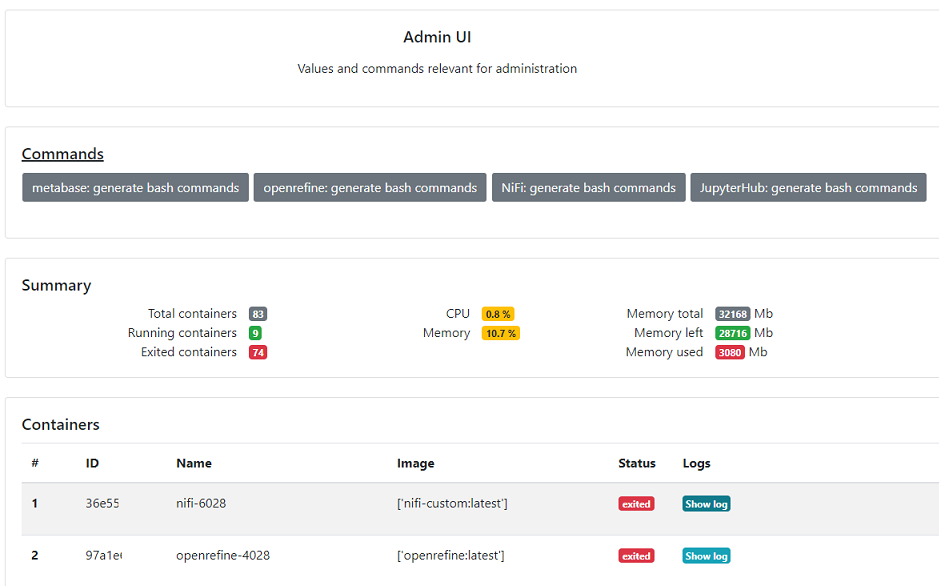

# About

**mta-system** (**m**odular **t**eaching **a**ssistance **system**) was designed to help students to acquire new hands-on software experience. The solution was designed to be modular by design and to be hosted by a lecturer/faculty member for students.

# Dependencies

* Python 3 + Flask + Docker + Nginx
* Further details are [requirements](requirements)

# Architecture

# Setup

# System UI

* User view. It is user by an user user to get access to the features of the system such as - services credentials, datasets imports, start/stop for services

* Admin view. It is used by an admin to monitor various parameters of a server - CPU usage, RAM usage, amount of containers running, logs, etc.

# License

* Code - [LICENSE](LICENSE)
* Datasets - mentioned directly inside the import module/dataset itself
